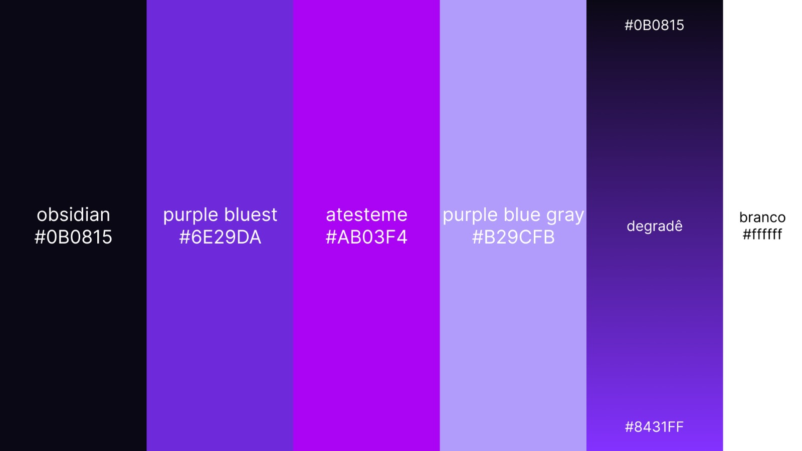

# 🎨 Nova Paleta de Cores 2026 - Ateste.me

## Referência Rápida



## Cores Principais

| Cor | Hex | RGB | Uso |
|-----|-----|-----|-----|
| **Obsidian** | `#0B0815` | rgb(11, 8, 21) | Textos em fundo claro (substitui preto) |
| **Atesteme** | `#AB03F4` | rgb(171, 3, 244) | **Botões principais** - cor da marca |
| **Purple Bluest** | `#6E29DA` | rgb(110, 41, 218) | Gestores - cor fria |
| **Purple Blue Gray** | `#B29CFB` | rgb(178, 156, 251) | Secundária - cor fria |
| **Coral** | `#E8674F` | rgb(232, 103, 79) | Professores - detalhes quentes |
| **Branco** | `#ffffff` | rgb(255, 255, 255) | Fundos e textos em áreas escuras |

---

## Gradientes

### Página Principal (Home)
```css
background: linear-gradient(135deg, #0B0815 0%, #6E29DA 50%, #8431FF 100%);
```

### Gradiente Principal
```css
background: linear-gradient(140deg, #0B0815 0%, #270a3e 50%, #8431FF 100%);
```

### Gestores (Cores Frias)
```css
background: linear-gradient(135deg, #0B0815 0%, #6E29DA 50%, #B29CFB 100%);
```

### Professores (Purple + Quente)
```css
background: linear-gradient(135deg, #B29CFB 0%, #AB03F4 50%, #E8674F 100%);
```

---

## Diretrizes de Uso

### ✅ FAZER

1. **Textos em fundo claro:**
   - ✅ Usar **Obsidian** (#0B0815) em vez de preto (#000000)
   
2. **Botões principais:**
   - ✅ Usar **Atesteme** (#AB03F4) como cor de fundo

3. **Página Gestores:**
   - ✅ Usar apenas **cores frias** (Purple Bluest, Purple Blue Gray, Obsidian)
   - ✅ SEM Coral (sem cores quentes)

4. **Página Professores:**
   - ✅ Usar **purple + coral**
   - ✅ Coral **apenas em detalhes** (ícones, acentos, badges)

5. **Página Principal:**
   - ✅ Usar o **gradiente principal** como background

### ❌ NÃO FAZER

1. ❌ Não usar preto puro (#000000) - usar Obsidian (#0B0815)
2. ❌ Não usar Coral na página Gestores (só cores frias)
3. ❌ Não usar as cores antigas (#9333ea, #7B2CBF, #171717)

---

## Variáveis CSS

```css
:root {
  /* Cores da Marca */
  --color-obsidian: #0B0815;
  --color-atesteme: #AB03F4;
  --color-purple-bluest: #6E29DA;
  --color-purple-blue-gray: #B29CFB;
  --color-coral: #E8674F;

  /* Gradientes */
  --gradient-home: linear-gradient(135deg, #0B0815 0%, #6E29DA 50%, #8431FF 100%);
  --gradient-gestores: linear-gradient(135deg, #0B0815 0%, #6E29DA 50%, #B29CFB 100%);
  --gradient-professores: linear-gradient(135deg, #B29CFB 0%, #AB03F4 50%, #E8674F 100%);

  /* Personas */
  --color-gestores-primary: var(--color-purple-bluest);
  --color-professores-primary: var(--color-atesteme);
  --color-professores-warm: var(--color-coral);
}
```

---

## Exemplos de Uso

### Botão Principal
```tsx
<button style={{ 
  background: 'var(--color-atesteme)',  // #AB03F4
  color: 'white'
}}>
  Iniciar Diagnóstico
</button>
```

### Texto em Fundo Claro
```tsx
<h1 style={{ 
  color: 'var(--color-obsidian)'  // #0B0815 (não preto!)
}}>
  Título Principal
</h1>
```

### Card Gestores (Cores Frias)
```tsx
<div style={{ 
  background: 'white',
  borderColor: 'var(--color-purple-bluest)',  // #6E29DA
  color: 'var(--color-obsidian)'              // #0B0815
}}>
  Conteúdo
</div>
```

### Card Professores (Purple + Coral)
```tsx
<div style={{ 
  background: 'var(--gradient-professores)'
}}>
  <h3 style={{ color: 'white' }}>Título</h3>
  <span style={{ color: 'var(--color-coral)' }}>🎓 Detalhe</span>
</div>
```

---

## Checklist de Implementação

- [ ] Atualizar `src/styles/colors.css` com novas variáveis
- [ ] Substituir todos os textos pretos por Obsidian
- [ ] Atualizar botões para usar Atesteme
- [ ] Página Gestores: só cores frias (sem Coral)
- [ ] Página Professores: purple + detalhes em Coral
- [ ] Página Principal: gradiente home
- [ ] Testar contraste de cores (WCAG AA)
- [ ] Documentar no DESIGN_SYSTEM.md
- [ ] Atualizar WORDPRESS_EXPORT.md

---

## Acessibilidade (Contraste)

| Combinação | Contraste | WCAG |
|------------|-----------|------|
| Obsidian em Branco | 19.5:1 | ✅ AAA |
| Atesteme em Branco | 5.8:1 | ✅ AA |
| Purple Bluest em Branco | 8.2:1 | ✅ AAA |
| Coral em Branco | 3.5:1 | ⚠️ AA Grande |
| Obsidian em Purple Blue Gray | 12.1:1 | ✅ AAA |

**Nota:** Coral deve ser usado apenas em detalhes ou textos grandes devido ao contraste moderado.

---

## Arquivos Atualizados

1. ✅ `src/styles/colors.css` - Sistema de cores completo
2. ✅ `DESIGN_SYSTEM.md` - Documentação atualizada
3. ✅ `WORDPRESS_EXPORT.md` - Guia WordPress com novas cores
4. ⏳ `src/app/components/ui/Button.tsx` - Componente de botão
5. ⏳ `src/app/components/ui/Card.tsx` - Componente de card
6. ⏳ `src/app/components/ui/Section.tsx` - Componente de seção
7. ⏳ `src/app/pages/HomePage.tsx` - Página principal
8. ⏳ `src/app/pages/GestoresPage.tsx` - Página gestores
9. ⏳ `src/app/pages/ProfessoresPage.tsx` - Página professores

---

**Data de Implementação:** Maio 2026  
**Versão:** 2.0 - Nova Paleta Frias e Quentes
